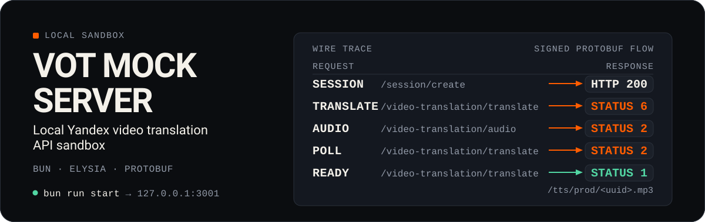

<div align="center">
  <h1>mock-server</h1>
  <p>Локальный Yandex-совместимый upstream для разработки и smoke-тестов VOT Worker</p>

  
</div>

`mock-server` позволяет проверять клиенты и реализации VOT Worker без обращения к реальному Yandex API. Он принимает protobuf-запросы, проверяет sec-заголовки, эмулирует состояния перевода и раздаёт локальные фикстуры аудио и субтитров

> Сервер предназначен только для разработки и тестов. Он не выполняет настоящий перевод и не подходит для production

## Быстрый старт

Требуется [Bun](https://bun.com)

```bash
cd mock-server
bun install
bun run start
```

Сервер запустится на `http://127.0.0.1:3001`. Проверка:

```bash
curl http://127.0.0.1:3001/health
# {"status":"ok"}
```

## Команды

| Команда             | Назначение                                     |
| ------------------- | ---------------------------------------------- |
| `bun run start`     | запустить сервер                               |
| `bun run dev`       | запустить сервер с автоматическим перезапуском |
| `bun run smoke`     | проверить Elysia, Axum и Cloudflare через mock |
| `bun test`          | запустить тесты                                |
| `bun run typecheck` | проверить TypeScript без генерации файлов      |

## Smoke-тесты воркеров

Smoke-runner сам запускает mock-server и выбранный воркер, выполняет общие сценарии перевода, субтитров и стримов, а затем останавливает процессы

```bash
# Все реализации последовательно
bun run smoke

# Только одна реализация
bun run smoke -- --worker axum
bun run smoke -- --worker elysia
bun run smoke -- --worker cloudflare
```

Требования к каждой реализации, доступные флаги, порты и список сценариев описаны в [smoke/README.md](./smoke/README.md)

## Конфигурация

| Переменная            | По умолчанию | Назначение                                        |
| --------------------- | ------------ | ------------------------------------------------- |
| `PORT`                | `3001`       | порт сервера                                      |
| `HOSTNAME`            | `127.0.0.1`  | адрес прослушивания                               |
| `SKIP_SEC_VALIDATION` | не задано    | значение `true` отключает проверку sec-заголовков |
| `NO_COLOR`            | не задано    | любое значение отключает ANSI-цвета               |
| `TERM`                | системное    | значение `dumb` отключает ANSI-цвета              |

Для локального клиента без подписывания запросов можно создать `.env`:

```dotenv
SKIP_SEC_VALIDATION=true
```

Этот флаг отключает только проверку sec-заголовков. Проверки Content-Type и protobuf-тела остаются включёнными

## Поддерживаемые маршруты

| Метод      | Путь                                         | Назначение                       |
| ---------- | -------------------------------------------- | -------------------------------- |
| `GET`      | `/health`                                    | проверка доступности             |
| `POST`     | `/session/create`                            | создание сессии                  |
| `POST`     | `/video-translation/translate`               | перевод видео                    |
| `PUT`      | `/video-translation/audio`                   | загрузка аудио                   |
| `POST`     | `/video-translation/cache`                   | состояние кеша и клонирования    |
| `PUT`      | `/video-translation/fail-audio-js`           | имитация ошибки аудио            |
| `POST`     | `/video-subtitles/get-subtitles`             | получение субтитров              |
| `POST`     | `/stream-translation/translate-stream`       | перевод стрима                   |
| `POST`     | `/stream-translation/ping-stream`            | ping активного стрима            |
| `GET/HEAD` | `/tts/prod/:file`                            | аудиофикстура с Range-поддержкой |
| `GET/HEAD` | `/vtrans/:uuid`                              | исходные субтитры                |
| `GET/HEAD` | `/vtrans/translated/:uuid`                   | переведённые субтитры            |
| `GET/HEAD` | `/stream-translation/stream-proxy/mock.m3u8` | тестовый HLS-плейлист            |

Protobuf-маршруты принимают `Content-Type: application/x-protobuf`. При
включённой проверке безопасности `/session/create` требует `Vtrans-Signature`, остальные защищённые маршруты — соответствующие `Vtrans-*` или `Vsubs-*` заголовки

Статические аудио и субтитры поддерживают `HEAD` и byte ranges: корректный диапазон возвращает `206`, невыполнимый — `416`

## Ограничения

- Сессии и состояние переводов хранятся в памяти и теряются при перезапуске
- Прогресс перевода эмулируется, а не рассчитывается по медиаданным
- Аудио и субтитры всегда берутся из локальных фикстур в `assets/`
